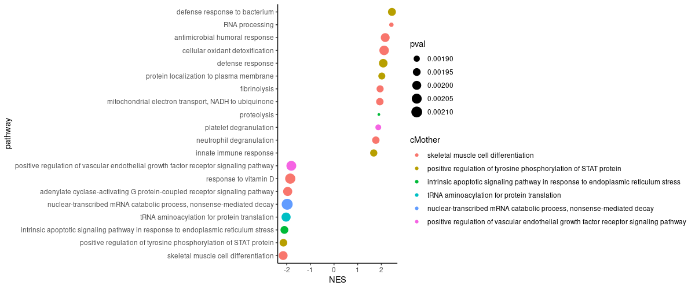

# gseaCondenser

An [R](https://www.r-project.org) package that aims to give better overviews over GSEA.

Table of contents:

- [Installation](#Installation)
- [condenseGsea](#condenseGsea)
- [freqGsea](#freqGsea)

# Installation
Install the package from the git repository:
``` r
devtools::install_github("nicolash2/ggbrace")
```

# condenseGSEA

condenseGsea takes a data.frame that must have a column with genes. Those could be all genes that were found or all genes that are in the set or just the leading edge. condenseGsea will return the same data.frame but with additional columns that give information about the parent-child relation between terms. Terms are related if they share enough genes with another set. The smaller set (in terms of how many genes it has) will normally be the child of the bigger set. However, the user can also define certain sets to be parents, in which case the will be the only parents around, and all other terms will become their children.

``` r
library(gseaCondenser)

gsea <- gseaCondenser::gseaTest                                # data set built into this package for demonstration purposes
gsea0 <- condenseGsea(gsea, similarity=0.1, idcol="pathway")   # here we use a very low similarity threshold. 0.8-1 might be more appropriate in many cases
```

The data.frame now contains few additional columns:

- cID: arbitrary number to identify the set
- cKids: cID of the sets that are considered children of this set
- cParents: cID of the sets that are considered parents of this set
- cMotherID: cID of the set that is considered the best parent (usually highest overlap)
- cShared: Ratio of the number of overlapping genes to the number of genes in the set
- cEve: boolean value, stating if the term has no parents (except itself)
- cMother: name of the mother set. This is only given if the user defines idcol

Let's plot the data to get an impression of the grouping. In ggplot, we use the cMother column for the coloring

```r
library(ggplot2)
plotme <- function(x){
  ggplot(x, aes(NES, pathway, size=pval, color=cMother)) +
    geom_point() +
    theme_classic()
}

plotme(gsea0)
```


We can define how many parents there should be (maximum).

```r
gsea1 <- condenseGsea(gsea, similarity=0.1, idcol="pathway", n_finalParents=6)
plotme(gsea1)
```



Alternatively, we can define the sets that are parents manually.

```r
gsea2 <- condenseGsea(gsea, idcol="pathway", finalParents = c("neutrophil degranulation",
                                                              "proteolysis", 
                                                              "adenylate cyclase-activating G protein-coupled receptor signaling pathway"))
plotme(gsea2)
```


Be aware in mind that defining n_finalParents or finalParents will force sets to be children of sets they might normally not have as parents. The similarity threshold will be disregarded (although n_finalParents uses it at first to determine suitable parents, so it is still important there).
In the next codechunk, we subset the data.frame, so that only terms with a similarity of 0.02 (which is already low) are in the plot. This throws out some terms that have almost 0 similarity with their parents.

```r
plotme(subset(gsea2, cShared>.02))
```


# freqGsea

freqGsea takes a vector of set names, cuts them up into pieces and returns a frequency table of all words from the set names. This also includes word-combinations of words that directly follow one another in a single set name. By default some words will be removed ("of","via",etc.) but you can switch this off, or even add terms that you might want not to be shown. Here we then use the [wordcloud2](https://github.com/Lchiffon/wordcloud2) package to vizualize the result.

``` r
library(gseaCondenser)
library(wordcloud2)

myfreq <- freqGsea(names(gseaCondenser::mySetlist)) # data set built into this package for demonstration purposes
wordcloud2(myfreq)
```

